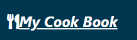
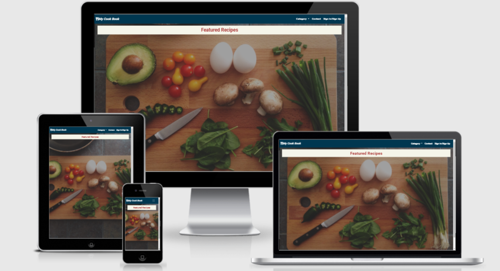
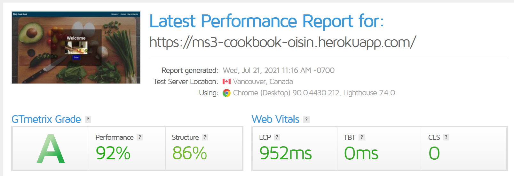
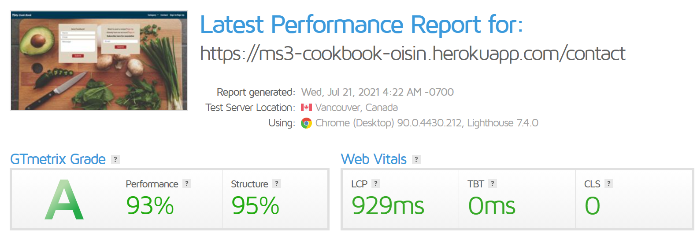
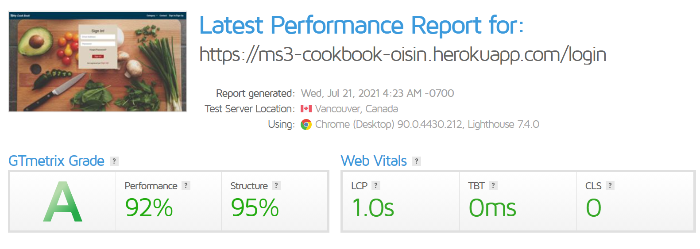

## Description

This is a fictional recipe book website created for my milestone project 3.

[LIVE DEPLOYMENT](https://ms3-cookbook-oisin.herokuapp.com/)

## Wireframes
The completed wireframes for this project can be accesed by clicking [Wireframes](https://github.com/McHugh1894/MS3-COOKBOOK/tree/master/static/images/readme-images/wireframes)

## Table of Contents

[User Experience (UX)](#UX)

[Features](#features)

[Design](#design)

[Technologies Used](#technologies)

[Testing](#testing)

[Deployment](#deployment)

[Known Bugs](#bugs)

[Credits](#credits)

## User Experience (UX)

### User Stories

This website gives information about different recipes with cooking methods posted by the website owner and other users. 
It is perfect for anyone with an interest in food and cooking.
In this website they get the information about numerous recipes based on categories.
This site also has a feature to create your own account and post recipes.

- #### Generic User
    1. I want the user to easily understand the purpose layout of the site without additional instructions needed.
    1. I want the user to intuitively navigate through the site to browse the content.
    1. I want the site to be responsive on all devices.
    1. I want to use the navigation at all times and have it readily available so I can quickly navigate from one page to another.

- ####  Admin/Site Owner
    1. As a site owner I want to read all the recipes.
    1. As a site owner I want to add, edit and delete my recipes.
    1. As a site owner I can delete other recipes from my site but  I can not edit whatever I want.
    1. As a site owner I want to manage the categories of recipes. I want to add, edit and delete the categories.
    1. As a site owner I want to recieve the feedback of users.
    
- #### User who wants to view recipe
    1. I want to check the recipe without logging in or signing up to the site.
    1. I want to get recipe by search option.
    1. I want to contact the site owner by sending message without login or sign up.
    1. I want to request the site owner for newsletter without login or sign up.

- #### User who wants to post recipe
    1. I want to create a profile by signing up.
    1. I want to easliy login and check my page.
    1. I want to add new recipe on my page and available to all users of site.
    1. I want to edit and delete my recipe only.
    1. I want to contact the site owner by sending a simple message.
    1. I want to request a newsletter.

## Design

### Defensive Design

- #### The user is not able to break the site by clicking on buttons.
- #### The add and edit recipe form:
    - The category has to be chosen.
    - The image URL must start with https://.
    - The servings, preparation time, cook time and total time has to be numbered.
- #### A recipe or category can't be deleted with just one click. 
    If the user clicks on the delete button, there wil be a modal with a confirmation message.

## Features

### Existing Features

- #### Common Features Across All Pages

    - Header allows user to easily navigate across all pages
      - The header itself is positioned to always be visible (positioned absolutely using Bootstrap 'fixed-top' class) at the top of the screen (mobile and desktop) which allows visitors to find it quickly.
      - The brand logo is positioned on the left and is visible on all pages.
      - Navigation is included in the header to let the user intuitively locate it.
      - Navigation links are more visible when hovered over. This lets the visitor know that it is clickable.
      - Navigation links collapse in a home menu when viewed on mobile device.
    
    - Accessibility
      - All Pages have a description in case the image link breaks as well as helps screen readers.
      - The home menu has aria-label added to let users with screen readers know where the toggleable menu is.
    
    - Buttons/Links
      - All buttons are styled in the way to provide consistency across the page.
      - All links have a hover effect.
      - All external links open in a new tab to allow the user to easily navigate back to the page. 
    
    - Flash messages
      - Messages displayed at the top of the page to provide the user confirmation of actions like sign out, adding or editing recipes etc.

    - Responsiveness
      - All Pages are responsive on different viewport size.

    - Footer
      - Footer has been designed to be at the bottom of the page, regardless of the amount of content. This aids the overall user experience.
      - All content has been spaced out and aligned to the center.
      - There are social links and when hovered over, it changes the color.

### Specific to Pages
- Home Page
  - This page has a header, footer and two sections. Featured recipes and popular recipes.

- Recipes Page
    - This page has a header, footer and search box. This page also has a list of all recipes with names and images.The header has a navigation bar and  the footer has copyright and social links.The image brings the user's attention and inviting the user to explore the website.

- Contact Page
    - This page contains a form where users can give feedback and ask questions. It has another form where users can request for newsletter by simply subscribe it. 

- Login Page 
    - This page has a login form. After logging in the user will reach on his page.

- Sign Up Page
    - This page has a sign up form. After sign up a profile page will be created where users can add recipes.

- Profile Page 
    - This page consists of all recipes of  the respective user.

- Category Page
    - Only admin can access this page. In this page admin can manage categories.

- Recipe Description Page
    - This page displays recipe description of selected recipe.

### Future Features
  - Create a way for the user to rate the website without having to type up feedback.
  - A reviews page.    

## Technologies Used

### Languages Used

  - [HTML5](https://en.wikipedia.org/wiki/HTML5)
  - [CSS3](https://en.wikipedia.org/wiki/Cascading_Style_Sheets)
  - [JavaScript](https://en.wikipedia.org/wiki/Javascript)
  - [Jquery](https://en.wikipedia.org/wiki/JQuery)
  - [Python](https://en.wikipedia.org/wiki/Python_(programming_language))

### Frameworks, Libraries and Programs Used

  - [Bootstrap v4.5.0](https://getbootstrap.com/) - Used for the responsive layout as well as custom components such as header, footer, images, icons, grids, cards, and collapse element.
  - [Font Awesome](https://fontawesome.com/) - Font Awesome is used to add social icons for social links.
  - [Google Fonts](https://fonts.google.com/) - Google Fonts is used to import 'Roboto'.
  - [Git](https://git-scm.com/) - Git is used to allow for tracking of any changes in the code and for the version control.
  - [GitPod](https://www.gitpod.io/) - GitPod, connected to GitHub, hosted the coding space and allowed the project to be committed to the Github repository.
  - [Github](https://github.com/) - GitHub is used to host the project files and publish the live website by using Git Pages.
  - [Heroku](https://www.heroku.com/) - Heroku is the cloud platform used to deploy the app.
  - [Flask](https://flask.palletsprojects.com/en/1.1.x/) - Flask is the web framework for the app.
  - [Jinja](https://jinja.palletsprojects.com/en/2.11.x/) - Jinja is used for the Python template.
  - [Werkzeug](https://werkzeug.palletsprojects.com/en/1.0.x/) - Werkzeug is used for password hashing , authentication and autohorization.

### Database

  - [MongoDB](https://www.mongodb.com/) - MongoDB is the fully managed cloud database service used for the project.

  ## Testing

### Functionality Testing
  - #### Navigation bar
     - The navigation bar stays at the top of the page on all screen sizes.
            - When the nav links clicks it opens the relevent page in same window with same header footer.
  - #### Footer
     - Footer is located at the bottom of the page regardless of the content amount.
     - When the social links are clicked, they open the relevant social media page in a new tab.
  
  - All external links is tested to make sure they open up the correct pages in new tabs.
  - All internal links is tested to make sure that all pages are correctly connected.

### Error Testing

* [W3C HTML Validator](https://validator.w3.org/) - ALL HTML pages passed with no errors after corrections made.
* [W3C CSS Validator](https://jigsaw.w3.org/css-validator/) - CSS style sheet passed with no errors.
* [JavaScript Validator](https://jshint.com/) - No errors found but warning.
* [Python Validator](https://extendsclass.com/python-tester.html - Pass

### Compatibility Testing
  - #### Browser Compatibility
    - Tested on Chrome, Firefox, Opera, Microsoft Edge, Safari.
  - #### OS Compatibility
    - Tested on iOS , Android 10 and Windows 10.
  - #### Tested for responsivness on [Chrome DevTools](https://developers.google.com/web/tools/chrome-devtools). 

### Speed Testing

I chose to run all my pages through [GT Metrix - Speed test](https://gtmetrix.com//) to get a view of the page load speeds.

## Deployment

- ### Working with the local copy
  1. Install all the requirements: Go to the workspace of your local copy. In the terminal window of your IDE type: pip3 install -r requirements.txt.
  2. Create a database in MongoDB
     - Signup or login to your MongoDB account.
     - Create a cluster and a database.
     - Create five collections in the db: categories, recipes, feedback, newsletter, users.
     - Add string values for the collections. See my database section how the database is set up for this project.
  3. Create the environment variables
     - Create a .gitignore file in the root directory of the project.
     - Add the env.py file in the .gitignore.
     - Create the file env.py. This will contain all the envornment variables.
        - Import os
        - os.environ.setdefault("IP", "Added by developer")
        - os.environ.setdefault("PORT", "Added by developer")
        - os.environ.setdefault("SECRET_KEY", "Added by developer")
        - os.environ.setdefault("MONGO_URI", "Added by developer")
        - os.environ.setdefault("MONGO_DBNAME", "Added by developer")
  4. Run the app: Open your terminal window in your IDE. Type python3 app.py and run the app.
  
- ### Heroku Deployment
  1. Set up local workspace for Heroku
     - In terminal window of your IDE type: pip3 freeze -- local > requirements.txt. (The file is needed for Heroku to know which file to install.)
     - In terminal window of your IDE type: python app.py > Procfile (The file is needed for Heroku to know which file is needed as entry point.)
  2. Set up Heroku: create a Heroku account and create a new app and select your region.
  3. Deployment method 'Github'
     - Click on the Connect to GitHub section in the deploy tab in Heroku.
       - Search your repository to connect with it.
       - When your repository appears click on connect to connect your repository with the Heroku.
     - Go to the settings app in Heroku and go to Config Vars. Click on Reveal Config Vars.
       - Enter the variables contained in your env.py file. it is about: IP, PORT, SECRET_KEY, MONGO_URI, MONGO_DBNAME
  4. Push the requirements.txt and Procfile to repository.
     - $ git add requirements.txt
     - $ git commit -m "Add requirements.txt"
     - $ git add Procfile 
     - $ git commit -m "Add Procfile"
  5. Automatic deployment: Go to the deploy tab in Heroku and scroll down to Automatic deployments. Click on Enable Automatic Deploys. By Manual deploy click on Deploy Branch.

  Heroku will receive the code from Github and host the app using the required packages. Click on Open app in the right corner of your Heroku account. The app wil open and the live link is available from the address bar. 

### Media :
- Images used were taken from [UnSplash website](https://unsplash.com/) and [Davey Nutrition](https://www.daveynutrition.com/)
- GIF for home page taken from [GIPHY] (https://giphy.com/gifs/Shakastrong-vegan-veggies-meal-prep-3IQ0wimBnJ9SccyJpS/links)

## Credits

* Credits go to my mentor Akshat Garg and the Codeinstitute/slack group for the help with this project

### Credited Code  
* [Bootstrap](https://getbootstrap.com/) - Documents used for support with bootstrap classes.
* [W3Schools](https://www.w3schools.com/howto/howto_js_scroll_to_top.asp) - Code used for top button.

